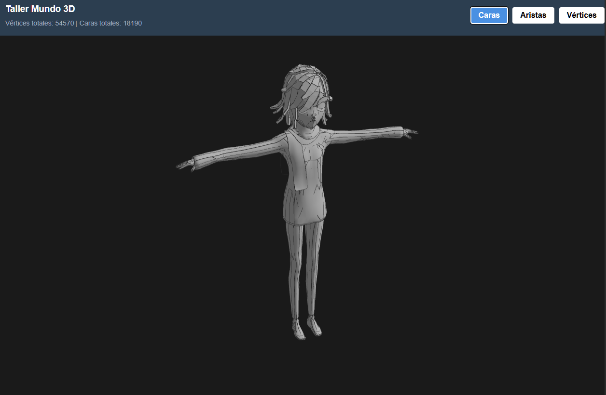
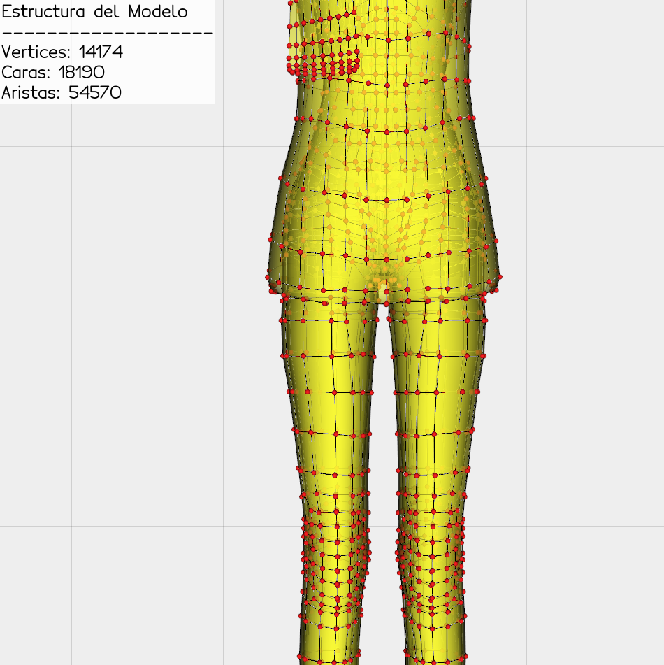

# Taller Construyendo Mundo 3D

**Nombre del estudiante:** Brayan Alejandro Muñoz Pérez
**Fecha de entrega:** 21 de Febrero de 2026

## Descripción breve
El objetivo de este taller es comprender las estructuras gráficas básicas que componen los modelos 3D (mallas poligonales). A través de implementaciones en JavaScript (Three.js) y Python, se exploraron las diferencias entre vértices, aristas y caras, cargando un modelo `.obj` y visualizando su topología y datos estructurales.

## Implementaciones

### 1. Three.js (React Three Fiber)
Se creó un proyecto utilizando Vite y React Three Fiber. El modelo 3D (`.obj`) se carga mediante `OBJLoader`. Se implementó una interfaz de usuario interactiva que permite:
* Ver la cantidad total de vértices y caras del modelo.
* Alternar entre vistas de "Caras" (modelo sólido con bordes delineados mediante `<Edges>`), "Aristas" (modo wireframe con material cian brillante) y "Vértices" (nube de puntos usando `<points>`).
* Explorar el modelo con `OrbitControls` y rotación automática.

### 2. Python (Trimesh / Vedo)
Se desarrolló un script de Python que procesa el mismo modelo `.obj`. 
* **Análisis de datos:** Se utilizó la librería `trimesh` para extraer con precisión la cantidad de vértices, aristas y caras de la malla.
* **Visualización:** Se empleó la librería `vedo` para renderizar el modelo. Para superar problemas de oclusión en el renderizado (z-fighting) al visualizar miles de puntos 2D, se utilizaron caras semi-transparentes amarillas, aristas negras y se inyectó geometría 3D real (`Spheres`) de color rojo para representar físicamente cada vértice.
* **Animación:** Se integró la herramienta `Video` (con backend `imageio`) para generar automáticamente un GIF de 360 grados del modelo rotando, incluyendo un overlay 2D con la información estructural.

## Resultados visuales

*(Los recursos se encuentran en la carpeta `media/`)*

### Three.js

*Descripción: Interfaz web renderizando el modelo 3D.*


*Descripción: Detalle estático de la malla poligonal y controles de UI.*

### Python

*Descripción: Animación generada por script rotando los 360 grados.*


*Descripción: Captura estática incluida para apreciar en máximo detalle el contraste visual entre caras (amarillo transparente), aristas (líneas negras) y la solución de vértices mediante esferas 3D (rojo).*

## Código relevante

**Uso de esferas para evitar oclusión de vértices en Vedo (Python):**
```python
vertices = Spheres(malla_tri.vertices, r=0.003, c="red")

```

**Manejo de múltiples sub-mallas en React Three Fiber:**

```javascript
obj.traverse((child) => {
  if (child.isMesh) {
    partsArray.push(child.geometry);
    vCount += child.geometry.attributes.position.count;
  }
});

```

## Prompts utilizados

Se utilizó asistencia de IA generativa para:

* Estructurar el componente base de React Three Fiber y resolver conflictos de dependencias en Vite.
* Solucionar problemas de renderizado de OpenGL en Windows al visualizar vértices utilizando `Spheres` en `vedo`.
* Corregir el estilo del contenido de los archivos `readme.md`

## Aprendizajes y dificultades

* **Aprendizajes:** Entender la diferencia entre cómo se componen matemáticamente los objetos (vértices, caras, aristas) y cómo las librerías los abstraen para dibujarlos en pantalla. También el uso práctico de esferas tridimensionales para burlar las limitaciones de oclusión de las tarjetas gráficas en Windows.
* **Dificultades:** Lidiar con conflictos de versiones de dependencias (ESLint en React y Pyglet/Vedo en Python) y lograr un contraste de colores óptimo para que todos los elementos topológicos fueran legibles simultáneamente.