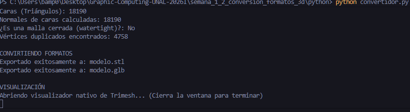
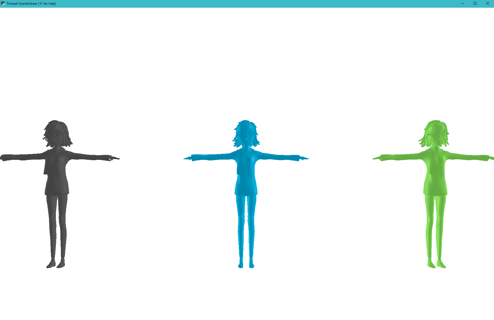
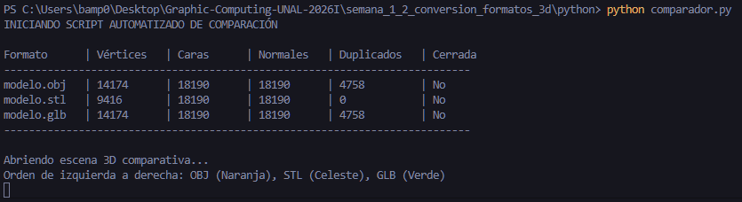
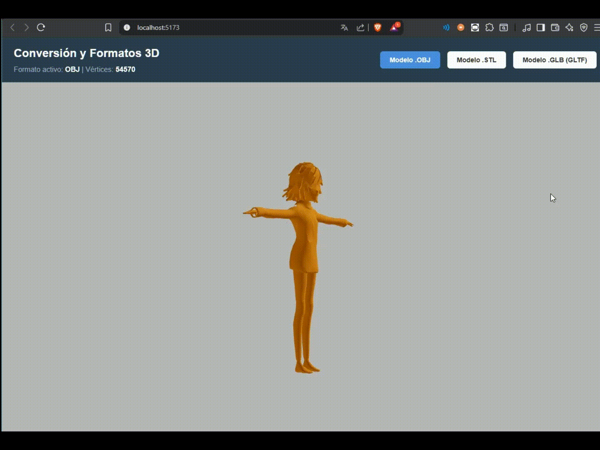
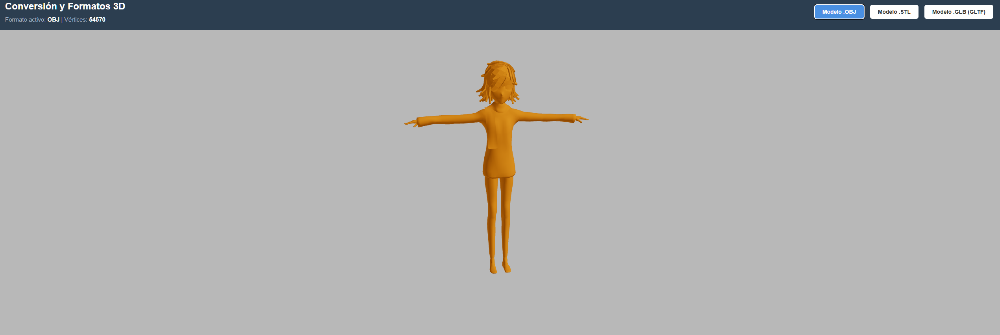

# Taller Conversion Formatos 3D

**Nombre del estudiante:** Brayan Alejandro Muñoz Pérez

**Fecha de entrega:** 21 de Febrero de 2026

## Descripción breve

Este taller se centró en la interoperabilidad de activos 3D, comparando los formatos `.OBJ`, `.STL` y `.GLB` (GLTF Binario). Se desarrollaron herramientas en Python para el análisis topológico y la conversión automatizada, y una aplicación web en Three.js para evaluar las diferencias de renderizado y eficiencia entre estos estándares de la industria.

## Implementaciones

### 1. Python (Análisis, Conversión y Comparación Automatizada)

Se desarrollaron dos scripts principales utilizando `trimesh`, `numpy` y `scipy`:

* **Conversión y Análisis Inicial (`convertidor.py`):** Transforma el modelo original `.obj` a `.stl` y `.glb`. Realiza un conteo de vértices, caras y normales.
* **Script de Comparación Automatizada (`comparador.py`):** Este script carga los tres formatos simultáneamente y genera una tabla comparativa en la consola.
* **Detección de Duplicados:** Mediante lógica de `numpy`, se identificó que el formato `.stl` triplica la cantidad de vértices reales al no soportar indexación de mallas (duplicados encontrados: 4758).
* **Visualización Multimodelo:** Se implementó una escena que renderiza los tres archivos uno al lado del otro con colores diferenciados para contrastar su geometría.

### 2. Three.js con React Three Fiber

Se creó una interfaz web interactiva para la comparación visual en tiempo real:

* **Carga de Formatos:** Implementación de `OBJLoader`, `STLLoader` y `useGLTF` dentro de un mismo entorno.
* **HUD Informativo:** La aplicación detecta automáticamente el formato seleccionado y muestra en pantalla el conteo de vértices reportado por la GPU.
* **Interactividad:** Uso de `OrbitControls` y luces direccionales para apreciar las normales y la suavidad de las caras en cada formato.

## Resultados visuales

*(Los recursos se encuentran en la carpeta `media/`)*

### Evidencias de Python

1. **Análisis de Consola:**

*Captura de la cantidad de duplicados en el modelo STL*
2. **Escena 3D Comparativa:**

*Visualización de los modelos OBJ, STL y GLB renderizados simultáneamente.*
3. **Conversión de Formatos:**

*Captura de la tabla comparativa automatizada generada por el script de conversión de Python.*

### Evidencias de Three.js

1. **Interfaz Web Interactiva:**

*GIF mostrando el cambio de modelos y la actualización de la información en el encabezado.*
2. **Detalle de Renderizado:**

*Captura estática de la interfaz visualizando el modelo convertido a .GLB.*

## Código relevante

**Script de comparación automatizada:**

```python
for archivo in archivos:
    malla = trimesh.load(archivo, force='mesh')
    verts = len(malla.vertices)
    unicos = len(np.unique(malla.vertices, axis=0))
    print(f"{archivo} | Vértices: {verts} | Duplicados: {verts - unicos}")

```

**Lógica de visualización del HUD en React:**

```jsx
useEffect(() => {
  setModelInfo({ format, vertices: vertexCount });
}, [format, vertexCount]);

```

## Prompts utilizados

* Configuración de la traslación de mallas en `trimesh.Scene` para posicionar los modelos sin que se superpongan.
* Corrección de estilo en el `readme.md`

## Aprendizajes y dificultades

* **Aprendizajes:** La diferencia fundamental en la arquitectura de los archivos: mientras el `.obj` y el `.glb` son eficientes al indexar vértices, el `.stl` es un formato "pesado" para la GPU debido a la redundancia de datos.
* **Dificultades:** Resolver la dependencia de `scipy` para el cálculo de normales y gestionar las rutas de archivos locales tanto en el script de Python como en la carpeta `public/` de Vite.