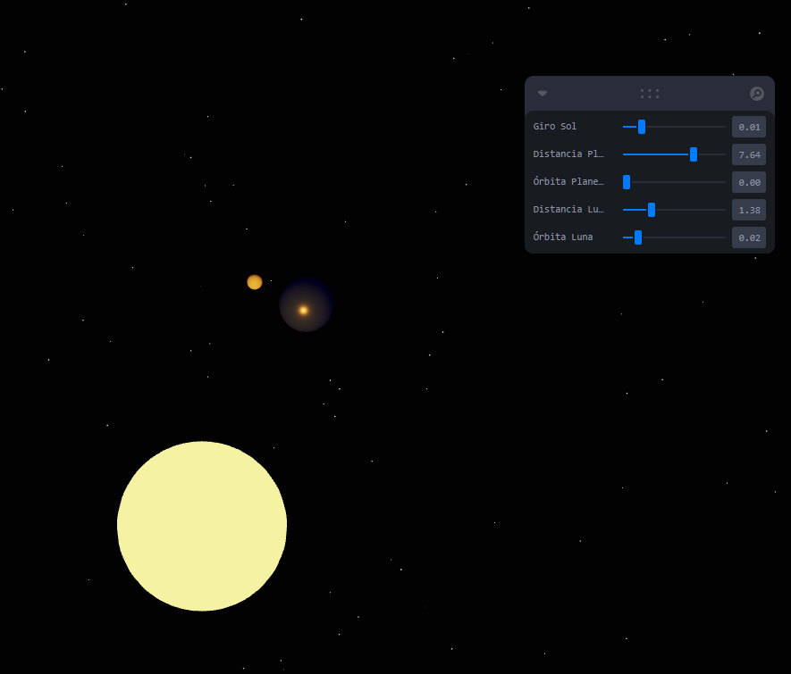
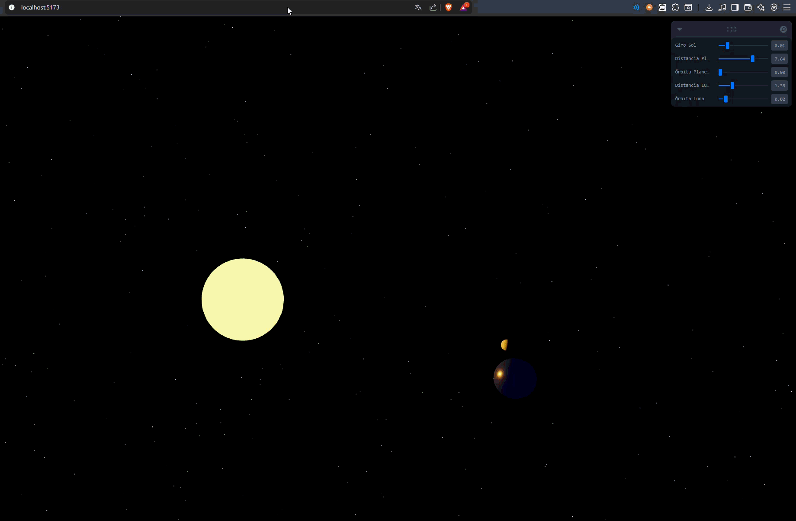
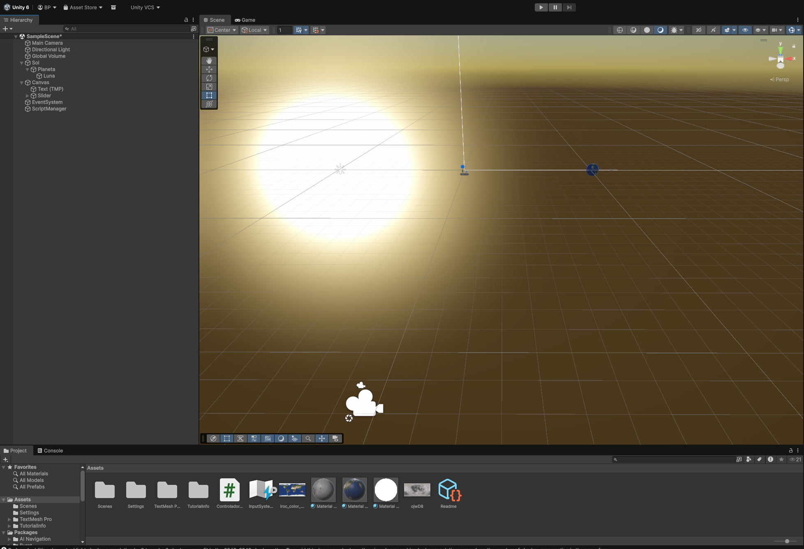

# Taller Jerarquias Transformaciones

**Nombre del estudiante:** Brayan Alejandro Muñoz Pérez
**Fecha de entrega:** 21 de Febrero de 2026

## Descripción breve

Este taller consistió en la implementación de sistemas jerárquicos de transformación utilizando el modelo de "Sistema Solar" (Sol → Planeta → Luna). Se exploró cómo las transformaciones aplicadas a un nodo padre afectan a sus descendientes de forma recursiva, tanto en un entorno de desarrollo web con Three.js como en un motor de videojuegos profesional con Unity.

## Implementaciones

### 1. Three.js con React Three Fiber

* **Árbol de Transformación:** Se utilizaron componentes `<group>` anidados para definir la jerarquía. El Sol actúa como el nodo raíz, mientras que el planeta y la luna heredan su posición y rotación base.
* **Interfaz de Control:** Se implementó la librería `leva` para permitir la manipulación dinámica de las velocidades de órbita y las distancias espaciales en tiempo real.
* **Bonus:** Se logró un tercer nivel de jerarquía funcional, permitiendo que la luna mantenga su propia órbita local mientras se desplaza con el planeta alrededor del sol.

### 2. Unity (HDRP)

* **Jerarquía de Objetos:** Uso del sistema nativo de Unity (Parent-Child) para establecer la dependencia espacial entre los astros.
* **Scripting en C#:** Se desarrolló un controlador que vincula sliders de la UI con las propiedades de rotación orbital mediante el método `RotateAround`.
* **Renderizado Avanzado:** Gracias a la potencia del hardware utilizado, se empleó el **High Definition Render Pipeline (HDRP)** para lograr sombras de contacto nítidas y materiales emisivos de alta calidad.

## Resultados visuales

Todos los recursos se encuentran organizados en la carpeta `media/` siguiendo la convención de nomenclatura solicitada.

### 1. Implementación en Three.js (Web)

* **Captura de Interfaz:** Muestra el panel de control de Leva y la disposición inicial de la jerarquía bajo una iluminación puntual.


* **Simulación Orbital:** Demostración del movimiento relativo de la Luna orbitando al Planeta mientras este se traslada alrededor del Sol.


### 2. Implementación en Unity (HDRP)

* **Sistema Solar en Movimiento:** Animación que evidencia la herencia de transformaciones y el sistema de sombras proyectadas en alta definición mediante el pipeline de HDRP.
*Nota: Se observa la rotación del Sol (Padre) influyendo en la orientación de todo el sistema planetario.*


* **Muestra de la jerarquía en Unity:** Muestra la jerarquía de objetos en Unity y la disposición inicial de la jerarquía bajo una iluminación puntual.


## Código relevante

**Estructura de la Luna como "nieto" en React Three Fiber:**

```jsx
<group ref={planetOrbitRef}>
  <mesh position={[planetDist, 0, 0]}>
    {/* El grupo de la luna vive dentro del espacio local del planeta */}
    <group ref={moonOrbitRef}>
      <mesh position={[moonDist, 0, 0]} />
    </group>
  </mesh>
</group>

```

**Control de órbita en C# para Unity:**

```csharp
// La luna orbita alrededor de la posición cambiante del planeta
luna.RotateAround(planeta.position, Vector3.up, (velocidad * 2.5f) * Time.deltaTime);

```

## Prompts utilizados

* Ayuda para que el `sol` sea la fuente de luz de la escena y poner texturas al `planeta` y `luna`.
* Ajuste del `Canvas Scaler` en Unity para resoluciones de alta gama.
* Corrección de estilo `readme.md`.

## Aprendizajes y dificultades

* **Aprendizajes:** Comprender que la escala es una de las transformaciones más "peligrosas" en una jerarquía, ya que se multiplica a través de los hijos. También, la utilidad de los `groups` vacíos como pivotes de rotación.
* **Dificultades:** Lograr que la **Point Light** del Sol proyectara sombras nítidas de la Tierra sobre la Luna en HDRP y configurar la UI para que no obstruyera la visión de la escena 3D.

```
