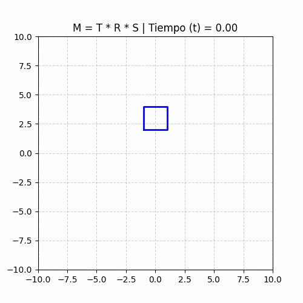
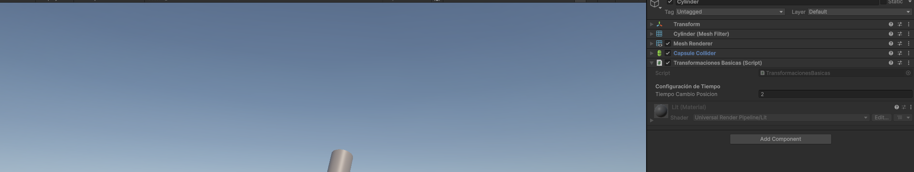
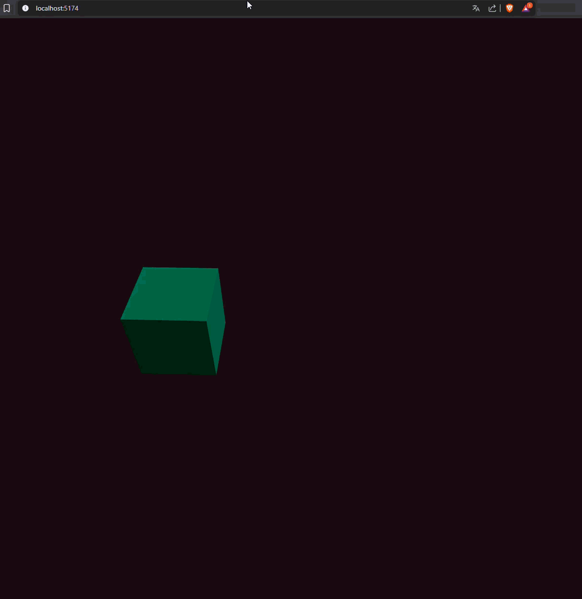

# Taller Transformaciones

**Nombre del estudiante:** Brayan Alejandro Muñoz Pérez
**Fecha de entrega:** 21 de Febrero de 2026

## Descripción breve
Este taller explora la aplicación matemática y práctica de las transformaciones geométricas fundamentales (traslación, rotación y escala) en la computación visual. Se desarrollaron demostraciones animadas en cuatro entornos distintos (Python, Unity, Three.js y Processing), utilizando funciones dependientes del tiempo (como el seno y el coseno) para generar movimientos oscilatorios, cíclicos y continuos sobre primitivas 2D y 3D.

## Implementaciones

### 1. Python (Matplotlib & Numpy)
* Se implementaron matrices de transformación de 3x3 (coordenadas homogéneas).
* Se operó matemáticamente sobre un arreglo de vértices bidimensionales.
* La animación se generó recalculando la matriz $M = T \cdot R \cdot S$ iterativamente y exportando los frames con `imageio`.

### 2. Unity (C#)
* Se utilizó un Cilindro 3D como primitiva visual.
* A través de un script en C#, se manipuló el componente `Transform` en el método `Update()`.
* Se combinaron saltos de traslación espaciados en el tiempo con una rotación dependiente de `Time.deltaTime` y una escala oscilatoria usando `Mathf.Sin`.

### 3. Three.js con React Three Fiber
* Se encapsuló la lógica de renderizado en un entorno web utilizando React.
* Mediante el hook `useFrame`, se accedió al `clock.elapsedTime` de la escena para actualizar las propiedades `.position`, `.rotation` y `.scale` de un cubo en cada ciclo de pintado.
* Se integró `OrbitControls` para permitir la navegación interactiva de la cámara.

### 4. Processing (Java)
* Se implementó un *sketch* 3D utilizando las funciones nativas `translate()`, `rotate()` y `scale()`.
* Se hizo uso de `pushMatrix()` y `popMatrix()` para mantener el sistema de coordenadas limpio en cada `draw()`, animando los valores mediante la variable `frameCount`.

## Resultados visuales

*(Todos los recursos se encuentran referenciados desde la carpeta `media/`)*

### Python
* **Animación Matricial:** 

### Unity
* **Cilindro y Script en Inspector:** 
* **Animación de Transformaciones:** 

### Three.js (Web)
* **Estado Inicial y Controles:** 
* **Animación Senoidal y Cíclica:** 

### Processing
* **Animación del Sketch:**  
*(Nota: Asegurar que este archivo esté en la carpeta si se generó la evidencia)*

## Código relevante

**Estructura de la Escala Oscilatoria en Three.js:**
```jsx
useFrame((state) => {
  const t = state.clock.elapsedTime;
  const escala = 1 + Math.sin(t * 3) * 0.5;
  meshRef.current.scale.setScalar(escala);
});

```

**Generación de posiciones en Unity:**

```csharp
float randomX = Random.Range(-4f, 4f);
transform.position = new Vector3(randomX, transform.position.y, 0f);

```

## Prompts utilizados

* Generación de la estructura de matrices 3x3 en NumPy para transformar vértices 2D mediante multiplicación de matrices ().
* Corrección de estilo en el `readme.md`.

## Aprendizajes y dificultades

* **Aprendizajes:** Comprender cómo las matemáticas de álgebra lineal aplicadas en Python son la base exacta que motores de alto nivel como Unity o Three.js abstraen y ocultan detrás de sus métodos de transformación.
* **Dificultades:** Sincronizar correctamente las funciones senoidales para que la interpolación de escala no invirtiera la geometría al pasar por números negativos, y ajustar la resolución de salida en Python para una compilación de GIF fluida.