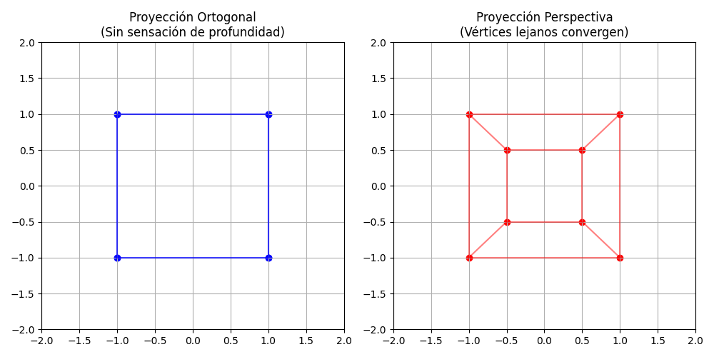

# Taller Espacios Proyectivos Matrices Proyeccion

**Nombre del estudiante:** Brayan Alejandro Muñoz Pérez  
**Fecha de entrega:** 27 de Febrero de 2026  
**Asignatura:** Computación Gráfica (2026-I) - Universidad Nacional de Colombia  

---

## 📘 Descripción del Taller

El objetivo de este taller es comprender, calcular y visualizar la transformación de vértices desde el espacio tridimensional (View Space) hacia un plano bidimensional (Clip Space y posteriores Normalized Device Coordinates - NDC). Se implementaron y compararon dos tipos fundamentales de proyección geométrica que ocurren durante la etapa del **Vertex Shader** en el pipeline gráfico:

1. **Proyección Ortogonal:** Mapea un volumen rectangular. Las líneas paralelas se mantienen paralelas, conservando las proporciones sin importar la profundidad ($Z$). La variable homogénea $w$ permanece constante.
2. **Proyección en Perspectiva:** Mapea un *Frustum* (pirámide truncada). Simula la visión humana dividiendo las coordenadas $X, Y, Z$ por la coordenada homogénea $w$ (Perspective Divide), haciendo que los objetos lejanos converjan hacia un punto de fuga.

---

## 💻 Implementaciones y Resultados Visuales

### 1. Python (Simulación Matemática del CPU)
Se implementó la multiplicación matricial pura simulando un Vertex Shader. Se manejaron las coordenadas homogéneas agregando la 4ta dimensión $w=1$. Para la matriz de perspectiva, se incluyó un blindaje matemático `w[w == 0] = 1e-6` para prevenir errores de `NaN` por división por cero antes del *Perspective Divide*.

**Evidencia Visual:**


**Código Relevante (Fragmento):**
```python
# Transformación al Clip Space
proy = P @ puntos_hom
# Prevención de NaN y Perspective Divide (Rasterización)
w = proy[-1, :]
w[w == 0] = 1e-6 
proy_ndc = proy / w

```

---

### 2. Three.js / React Three Fiber (WebGL Pipeline)

Se construyó una escena web interactiva manipulando la matriz de proyección en tiempo real enviada a la GPU. Se utilizó `Leva` para inyectar variables uniformes controladas (FOV, Near, Far) previniendo el colapso del Frustum (Near $\ge$ Far). Se integró `OrbitControls` para alterar la matriz *Model-View* dinámicamente.

**Evidencias Visuales:**
| Perspectiva | Ortogonal |
| :---: | :---: |
|  |  |

**Interacción en Tiempo Real:**

---

### 3. Unity HDRP (Motor Gráfico de Alto Rendimiento)

Se utilizó el High Definition Render Pipeline (HDRP) para renderizar volumetría avanzada. Se programó un script `ProjectionController.cs` que reconstruye la matriz de proyección de la cámara en tiempo de ejecución interceptando el teclado mediante el **New Input System** de Unity.

**Evidencia Visual:**

**Código Relevante:**

```csharp
if (Keyboard.current != null && Keyboard.current.spaceKey.wasPressedThisFrame) {
    cam.orthographic = !cam.orthographic; // Altera la generación de la matriz P
}

```

---

### 4. Processing 3D (Llamadas Raw de OpenGL)

Se utilizó el renderizador `P3D` para realizar invocaciones directas a bajo nivel (`ortho()` y `perspective()`). Se implementó un entorno con profundidad en el eje $Z$ y un HUD (Head-Up Display) en espacio de pantalla deshabilitando temporalmente el *Depth Testing* (`hint(DISABLE_DEPTH_TEST)`).

**Evidencia Visual:**

---

## 🤖 Prompts Utilizados (IA Generativa)

Durante el desarrollo se utilizó asistencia de un modelo de lenguaje (Gemini) actuando bajo el rol de "Computación Visual" (Desarrollador Senior/Tutor). Los prompts principales fueron:

* Resolución de errores de consola: *Prompt con el error `source: The term 'source' is not recognized` en PowerShell.*
* Resolución de errores de Unity: *Prompt con el error `InvalidOperationException: You are trying to read Input using the UnityEngine.Input class...*`
* Resolución de límites de Windows: *Prompt con el error de compilación de Unity `path length that exceeds the character limit`.*
* Corrección de estilo y complementar el `README.md`

## 🧠 Aprendizajes y Dificultades

1. **El Límite MAX_PATH de Windows:** La estructura de carpetas requerida combinada con los archivos temporales de Unity HDRP (`Library/PackageCache/...`) superó el límite de 260 caracteres de Windows, impidiendo la creación del proyecto. Se solucionó moviendo el repositorio a una ruta base más corta y activando `core.longpaths true` en Git.
2. **Conflictos de Terminal (Git Bash vs PowerShell):** La activación de entornos virtuales de Python difiere entre terminales. Se aprendió a usar `.\venv\Scripts\Activate.ps1` y sortear las políticas de ejecución (`ExecutionPolicy`) de PowerShell en lugar de usar los comandos Unix (`source`, `touch`).
3. **Colisión de APIs de Input en Unity:** Al usar una plantilla moderna de HDRP, el motor ya tenía preconfigurado el *New Input System*, lo que bloqueó el script inicial basado en la API clásica. Se aprendió a importar `UnityEngine.InputSystem` y leer eventos directamente del dispositivo físico (`Keyboard.current.spaceKey.wasPressedThisFrame`).
4. **Fundamentos Matemáticos:** Entender que la proyección no es magia de la GPU, sino una simple matriz de 4x4 que, multiplicada por un vector de posición, prepara los datos para que el hardware ejecute la división por $w$.