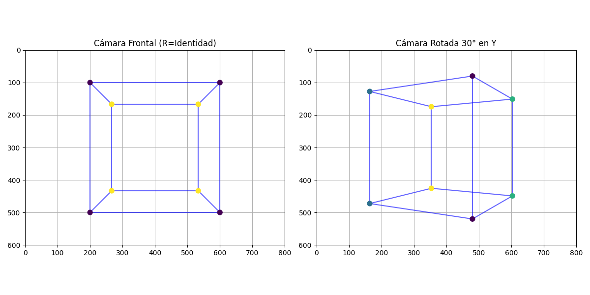
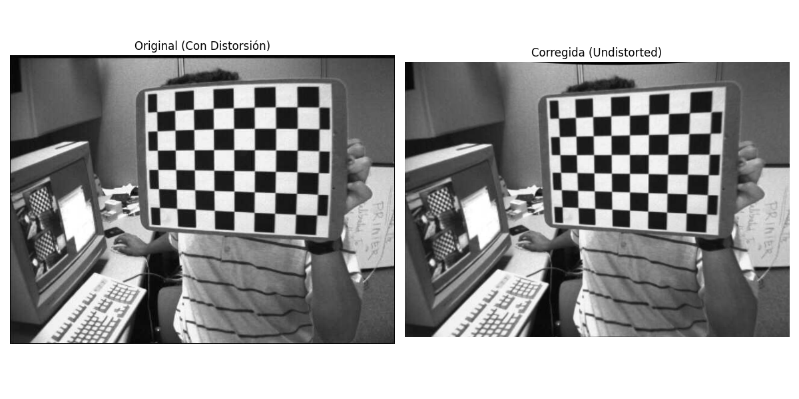

# Taller Camara Pinhole Calibracion

**Nombre del estudiante:** Brayan Alejandro Muñoz Pérez  
**Fecha de entrega:** 27 de Febrero de 2026  
**Asignatura:** Computación Gráfica (2026-I) - Universidad Nacional de Colombia  

---

## 📘 Descripción del Taller

El objetivo de este taller es comprender e implementar la matemática detrás del modelo de cámara Pinhole y el proceso de calibración de lentes reales. Se exploró cómo una coordenada tridimensional $(X, Y, Z)$ se proyecta en un píxel bidimensional $(u, v)$ a través de la ecuación maestra de la cámara: 
$$s \begin{bmatrix} u \\ v \\ 1 \end{bmatrix} = K [R|t] \begin{bmatrix} X \\ Y \\ Z \\ 1 \end{bmatrix}$$
Adicionalmente, se utilizó Visión por Computador para estimar estas matrices en un entorno real y corregir la distorsión radial introducida por la curvatura de las lentes físicas.

---

## 💻 Implementaciones por Entorno

### 1. Python (Simulador Matemático Pinhole)
Se construyó un motor de proyección desde cero utilizando `numpy` y `matplotlib`. Se multiplicaron vértices 3D por una matriz extrínseca de traslación/rotación ($[R|t]$) para llevarlos al *Camera Space*, y luego por una matriz intrínseca simulada ($K$) para proyectarlos al plano de imagen. Se implementó un algoritmo manual de *Perspective Divide* blindado contra divisiones por cero.

### 2. Python (Calibración Real con OpenCV)
Se desarrolló un pipeline automatizado para calibrar una cámara real usando 13 imágenes de un patrón de ajedrez (Checkerboard). 
* **Extracción de características:** Se detectaron las esquinas internas del tablero con precisión sub-píxel (`cv2.cornerSubPix`).
* **Calibración:** Se calcularon la verdadera matriz intrínseca y los coeficientes de distorsión $D$.
* **Corrección:** Se aplicó `cv2.undistort` para "planchar" la imagen, eliminando el efecto barril.

### 3. Three.js / React Three Fiber (Visualización de Frustum)
Se creó una herramienta interactiva en WebGL para visualizar el Frustum (volumen de visión) de una cámara Pinhole usando `CameraHelper`. A través de un HUD dinámico, se calculó en tiempo real cómo la alteración del campo de visión (FOV) afecta matemáticamente la distancia focal ($f_x, f_y$) de la matriz intrínseca $K$, dado el tamaño de la pantalla en píxeles.

---

## 🖼️ Resultados Visuales

### Simulador Matemático (Pinhole desde cero)
Visualización de un cubo 3D proyectado a 2D. Se observa el efecto de aplicar una rotación extrínseca de $30^\circ$ en el eje Y.


### Calibración y Corrección de Distorsión (OpenCV)
Comparación entre la imagen cruda del sensor (curvada por la lente) y la imagen procesada tras aplicar los coeficientes de distorsión obtenidos por la calibración.


### Frustum y Matriz Intrínseca Dinámica (Three.js)
El entorno 3D muestra la pirámide de visión. El HUD calcula la matriz $K$ en tiempo real basándose en la resolución de pantalla y el FOV.


---

## 📄 Parámetros Obtenidos (OpenCV)

La calibración arrojó resultados de altísima precisión:
* **Matriz Intrínseca (K):**
  $$K = \begin{bmatrix} 536.07 & 0 & 342.37 \\ 0 & 536.01 & 235.53 \\ 0 & 0 & 1 \end{bmatrix}$$
  *(La similitud entre $f_x$ y $f_y$ confirma que el sensor tiene píxeles cuadrados).*
* **Coeficientes de Distorsión (D):**
  $[-0.2650, -0.0467, 0.0018, -0.0003, 0.2523]$
* **Error Medio de Reproyección:** **0.0410 píxeles** (Precisión Sub-píxel excelente).

---

## ⌨️ Código Relevante

**Perspective Divide Seguro (Python puro):**
```python
# Prevenir división por cero extrayendo Z antes del divide
Z = points_cam[2, :]
Z[Z == 0] = 1e-6 
u = points_img_hom[0, :] / Z
v = points_img_hom[1, :] / Z

```

**Cálculo Dinámico de Distancia Focal (Three.js):**

```javascript
// La distancia focal en y se deduce del FOV y la altura de la pantalla
const fy = (height / 2) / Math.tan(THREE.MathUtils.degToRad(fov / 2));
const fx = fy * (width / height); // Asumiendo píxeles cuadrados

```

---

## 🤖 Prompts Utilizados (IA Generativa)

* *"Crear visualización en Three.js con CameraHelper y cálculo en tiempo real de la matriz intrínseca K basándose en el FOV".*
* *"Corrección de estilo y complementar el `README.md`"*

## 🧠 Aprendizajes y Dificultades

1. **Distorsión Radial en la Práctica:** Al observar el primer coeficiente de distorsión $k_1 = -0.265$, aprendí que un valor negativo indica una fuerte "distorsión de barril". Ver cómo `cv2.undistort` endereza físicamente las líneas de la madera fue revelador.
2. **El significado del Error de Reproyección:** Entender que 0.0410 píxeles significa que, al proyectar matemáticamente los puntos 3D de vuelta a la imagen 2D, estos caen a menos de media décima de píxel de distancia de la esquina real detectada por el algoritmo.
3. **Matemática vs Hardware:** Diferenciar claramente entre las métricas físicas (Extrínsecos: dónde está la cámara en el mundo) y las métricas del sensor/lente (Intrínsecos: cómo la luz golpea los píxeles).