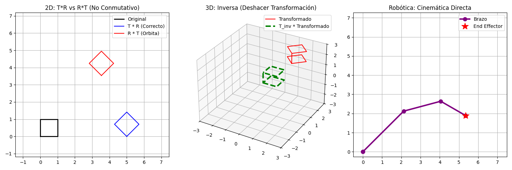
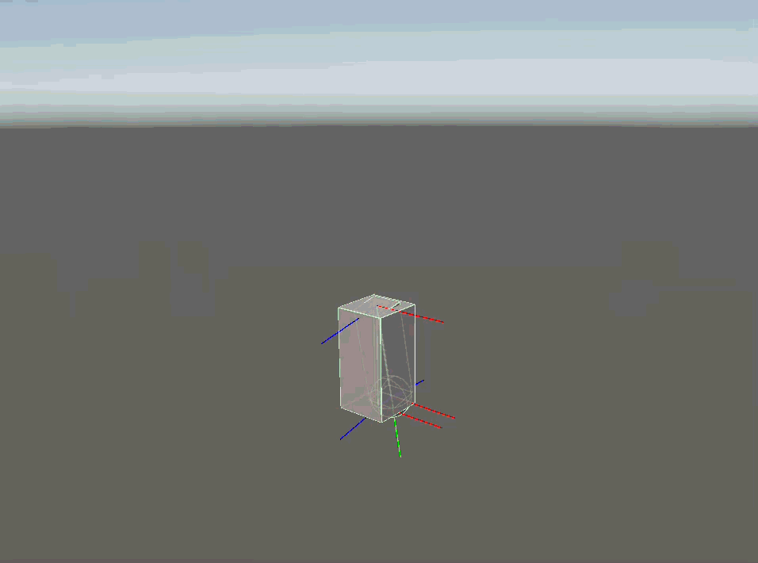

# Taller Transformaciones Homogeneas

**Nombre del estudiante:** Brayan Alejandro Muñoz Pérez  
**Fecha de entrega:** 27 de Febrero de 2026  
**Asignatura:** Computación Gráfica (2026-I) - Universidad Nacional de Colombia  

---

## 📘 Descripción del Taller

El objetivo de este taller es dominar la **Matriz de Modelo** mediante el uso de transformaciones afines homogéneas en espacios 2D y 3D. Se exploró la construcción de matrices de Traslación, Rotación y Escala, demostrando matemáticamente su naturaleza no conmutativa. Además, se aplicaron estos conceptos a grafos de escena (*Scene Graphs*) y cadenas cinemáticas directas (*Forward Kinematics*), comprendiendo cómo los cambios de base permiten a los objetos anidados transitar desde su espacio local (*Local Space*) hacia el espacio global (*World Space*).

---

## 💻 Implementaciones por Entorno

### 1. Python (Simulación Matemática Pura)
Se utilizó `numpy` para construir las matrices homogéneas base. El script se dividió en tres actos:
* **Prueba de no conmutatividad:** Demostración gráfica de que $T \cdot R \neq R \cdot T$.
* **Inversas:** Aplicación de una matriz $M$ a un cubo 3D y su posterior anulación multiplicando por $M^{-1}$.
* **Cinemática Directa:** Simulación de un brazo robótico planar calculando la posición absoluta de la herramienta final (End Effector) mediante la composición de matrices locales de cada articulación.

### 2. Unity HDRP (Jerarquías y Cinemática Visual)
Se construyó un brazo robótico funcional separando las articulaciones matemáticas (Pivotes/Objetos Vacíos) de las mallas visuales para asegurar rotaciones correctas. Se desarrolló un script que:
* Anima los espacios locales de las articulaciones.
* Calcula manualmente la cinemática directa usando `Matrix4x4.TRS()` y multiplicando la cadena jerárquica padre-hijo.
* Dibuja los sistemas de coordenadas locales (Gizmos) para visualizar el cambio de base.

### 3. Three.js / React Three Fiber (Matrices Manuales en WebGL)
Se simuló un sistema solar para demostrar las jerarquías. En lugar de usar el motor automático de Three.js, se deshabilitó la propiedad `matrixAutoUpdate` en la Tierra. Se inyectó una Matriz de Transformación Homogénea compuesta manualmente ($M = R_{orbita} \cdot T_{distancia} \cdot R_{giro} \cdot S$), imprimiendo la matriz resultante $4 \times 4$ en un HUD de HTML interactivo. La Luna, al ser un nodo hijo en el grafo, heredó automáticamente esta transformación.

---

## 🖼️ Resultados Visuales

### Matemáticas de Transformación (Python)
Demostración de matrices 2D, inversiones 3D y cinemática directa calculada con `numpy`.


### Grafo de Escena y Pivotes (Unity)
Brazo robótico animado donde se observan los ejes locales (Gizmos) rotando con sus respectivos padres.


### Matrices Manuales (Three.js)
Sistema Solar jerárquico inyectando la Matriz Homogénea $4 \times 4$ directamente al pipeline de WebGL.


---

## ⌨️ Código Relevante

**Cinemática Directa (Multiplicación en Cadena - Python):**
```python
# Composición de matrices desde la base hasta la herramienta final
T04 = H01 @ H12 @ H23 @ H34
p4 = T04 @ origen # Posición global de la mano

```

**Composición Manual con `Matrix4x4` (Unity):**

```csharp
Matrix4x4 mShoulder = Matrix4x4.TRS(shoulder.localPosition, shoulder.localRotation, shoulder.localScale);
Matrix4x4 mArm = Matrix4x4.TRS(arm.localPosition, arm.localRotation, arm.localScale);
Matrix4x4 mHand = Matrix4x4.TRS(hand.localPosition, hand.localRotation, hand.localScale);
// MGlobal = M_padre * M_hijo * M_nieto
Matrix4x4 mGlobalHand = mShoulder * mArm * mHand;

```

**Desactivación del Motor Automático (Three.js):**

```javascript
earthMatrix.multiply(orbitRotation).multiply(translation).multiply(spinRotation).multiply(scale);
earthRef.current.matrixAutoUpdate = false;
earthRef.current.matrix.copy(earthMatrix);

```

---

## 🤖 Prompts Utilizados (IA Generativa)

Se utilizó el asistente virtual "Computación Visual" para estructurar los proyectos y depurar errores gráficos:

* *"El brazo en Unity se despega y gira extraño."* -> **Aprendizaje:** Separación del centro de masa visual mediante pivotes matemáticos en objetos vacíos (`Empty GameObjects`).
* *"Corrección de estilo y complementar el `README.md`"*

## 🧠 Aprendizajes y Dificultades

1. **Pivotes vs Mallas:** En motores gráficos (Unity/Three.js), el punto de origen de una geometría no siempre es el punto de rotación ideal. Se aprendió a usar nodos vacíos como "articulaciones" para mover el punto de pivote a la base o codo del objeto.
2. **No Conmutatividad Rigurosa:** En Three.js, al componer la matriz de la Tierra manualmente, intentar aplicar la traslación de la órbita antes de la rotación orbital destruía el efecto. El orden estricto de multiplicación define si un objeto orbita un punto o gira sobre sí mismo.
3. **Extracción de Traslación:** Entender que en una matriz de $4 \times 4$, la cuarta columna (`m[12], m[13], m[14]`) contiene el vector de posición global puro una vez que todas las rotaciones y escalas han sido resueltas en los cambios de base.
